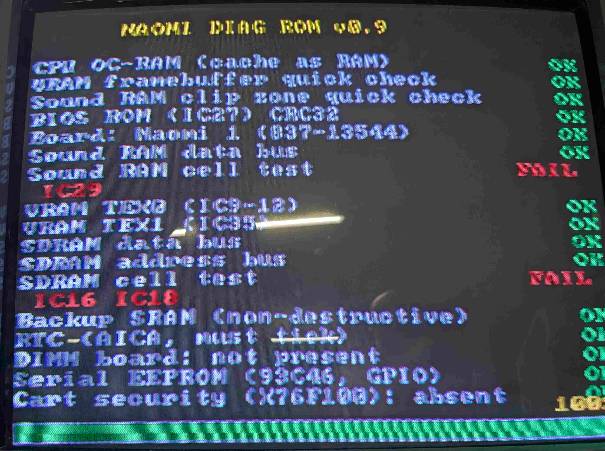

# NaomiDiag

ROM de BIOS de diagnostic pour les cartes d'arcade **SEGA Naomi** et
**Naomi 2**. Elle remplace le BIOS d'origine dans le support IC27 et teste
les composants de la carte un par un, en rapportant les résultats sur trois
canaux — **série (SCIF)**, **écran (VGA)** et **voix** — sans jamais
dépendre d'une mémoire dont le bon fonctionnement n'a pas encore été prouvé.

Disponible en **anglais** et en **français**, texte et voix localisés.
Les ROMs pré-compilées prêtes à graver sont sur la page
[**Releases**](https://github.com/Guimli/NaomiDIAG/releases/latest) —
téléchargement direct :
[NaomiDIAG_EN.bin](https://github.com/Guimli/NaomiDIAG/releases/latest/download/NaomiDIAG_EN.bin)
·
[NaomiDIAG_FR.bin](https://github.com/Guimli/NaomiDIAG/releases/latest/download/NaomiDIAG_FR.bin).

> English: see [README.md](README.md).



Le rapport à l'écran, photographié sur une Naomi 1 réelle. Cette carte n'est
pas saine, et la ROM le dit : le test cellule de la RAM son échoue et nomme
**IC29**, celui de la RAM CPU échoue et nomme **IC16** et **IC18** — les deux
puces portant le mot pair de 32 bits. Les tests de bus passent, donc les
puces répondent ; ce sont leurs cellules qui ne tiennent pas. Tout le reste
est au vert.

## Trois canaux de sortie simultanés

Chaque résultat de test est rapporté **en même temps sur tous les canaux
alors disponibles** — série, puis série + audio, puis série + audio + vidéo
— pour que l'opérateur puisse au choix regarder, écouter ou capturer le
journal. À mesure qu'un résultat est produit, il est imprimé sur le SCIF,
énoncé à voix haute et affiché à l'écran VGA, ensemble.

L'ordre d'activation des canaux suit ce dont chacun a besoin :

- Le **port série SCIF** est la seule sortie entièrement interne au SH-4 :
  il fonctionne dès le reset **sans aucune RAM externe**, c'est le canal
  primaire, toujours disponible.
- L'**audio** a besoin de la RAM son (derrière l'AICA) et la **vidéo** de la
  VRAM (derrière le PowerVR) ; ces mémoires sont testées d'abord, et chaque
  canal ne s'active qu'une fois sa propre mémoire validée. Quand l'audio
  s'active, il rejoue d'abord tous les résultats déjà acquis, puis rapporte
  en direct.

Comme le son et la vidéo sont activés avant le long test de la RAM
principale, la machine ne paraît jamais figée pendant ce test d'environ une
minute — l'écran affiche déjà les résultats précédents et le SCIF imprime la
progression passe par passe.

Les rapports vocaux sont bloquants, avec au moins une seconde de silence
entre deux messages pour éviter tout chevauchement.

## Ce qui est testé

Dans l'ordre :

1. **Cœur SH-4** — le cache est configuré en RAM interne et auto-testé ;
   il sert aussi de pile/`.bss` à toute la ROM (aucune RAM externe utilisée
   avant d'être validée).
2. **Identification de la carte** — Naomi 1 ou Naomi 2 (signature Elan +
   aliasing VRAM).
3. **EPROM BIOS (IC27)** — auto-contrôle CRC32.
4. **RAM son** (AICA, 8 Mo, bus G2) — puis l'audio devient un canal.
5. **VRAM** (PowerVR TEX0 = IC9-12, TEX1 = IC35) — puis l'écran de rapport
   VGA s'active.
6. **RAM CPU principale** (SDRAM, 16/32 Mo, IC16/18/20/22) — d'abord un test
   bus de données (walking-ones) et un test bus d'adresses, puis **trois
   phases**, annoncées `passe n/3` et menant chacune la barre de progression
   de 0 à 100 % :
   - **1/3** — écriture de `0x55555555` (0101…) sur toute la zone, puis
     relecture complète et comparaison ;
   - **2/3** — écriture de `0xAAAAAAAA` (1010…) sur toute la zone, puis
     relecture et comparaison ;
   - **3/3** — écriture d'un flux pseudo-aléatoire en accumulant un **CRC32
     conservé dans un registre CPU**, puis relecture de la zone en
     recalculant le CRC et comparaison avec le CRC d'écriture ainsi que mot
     à mot.

   Toute cellule défectueuse condamne la puce entière (et donc toute la RAM
   entrelacée), qui n'est plus utilisée pour la suite du programme. Si
   **toute** la RAM CPU est défectueuse, le programme continue depuis le
   cache du SH-4 (OC-RAM) et effectue tous les tests ne nécessitant pas la
   RAM principale — seul le test Maple/MIE, qui a besoin de RAM pour ses
   descripteurs DMA, est ignoré.
7. **Naomi 2 uniquement** — VRAM du PVR esclave (16 Mo) et RAM Elan (32 Mo).
8. **NVRAM de sauvegarde** — test non destructif (sauvegarde/restauration).
9. **RTC** (AICA) — vérification non destructive de l'avance de l'horloge.
10. **Carte DIMM** (mailbox G1) — présence et cohérence de la mailbox.
11. **Bus Maple / MIE** (Z80 315-6146) — requête de version + auto-test
    d'usine.
12. **EEPROM des réglages** (93C46 via MIE) — base posée (nécessite un
    upload de code Z80 ; documenté).
13. **EEPROM numéro de série** (93C46 sur GPIO du SH-4) — lecture + contrôle
    du contenu.
14. **Sécurité cartouche** (X76F100) — présence par response-to-reset.
15. **Contenu cartouche** — identifie le jeu dans une base embarquée de tous
    les jeux cartouche Naomi/Naomi 2 connus (192 jeux, 2298 IC) et vérifie
    chaque puce ROM par SHA-1, en nommant l'IC fautive par sa sérigraphie.
16. **Complétude du jeu de ROM cartouche** — une fois le jeu identifié,
    **l'ensemble des puces nécessaires à ce jeu** est vérifié : chaque mask
    ROM de la fiche de la base est sondée et le résultat est affirmé
    explicitement (`jeu de ROM : 13 / 13 puces presentes`). Une puce qui
    répond un 0xFFFF/0x0000 constant partout est signalée comme *ne
    répondant pas* (absente, mal enfichée, morte) plutôt que comme contenu
    erroné, et une puce renvoyant les mêmes octets qu'une autre est
    signalée comme miroir d'adresses — un support vide auquel une puce
    voisine répond. La présence est vérifiée sur toutes les puces même en
    build QUICK ; seul le hachage est réduit.
17. **Lignes de données cartouche** — statistiques par broche sur le bus
    16 bits : proportion de 1 lue par chaque ligne (une ligne qui ne bascule
    jamais est figée), plus la comparaison de deux lectures des mêmes
    adresses — tout bit qui diffère trahit une ligne instable, signature
    d'un transceiver fatigué ou d'un connecteur encrassé. Ce test tourne
    même quand le jeu n'est pas identifiable, puisqu'une ligne morte est
    précisément ce qui empêche l'identification.

Les pannes RAM sont rapportées par composant : masque de bits, lanes de
données concernées, et désignateur IC sérigraphié (ex.
`RAM CPU 1 (IC16) DEFECTUEUX`).


### Où s'exécutent les boucles de test

Le SH-4 démarre en P2, fenêtre que le matériel ne cache jamais : chaque
instruction est un cycle de bus vers l'EPROM de démarrage. Lier toute la ROM
en P1 (l'alias caché de la zone de démarrage) a été essayé sur matériel réel
et la carte le refuse — écran noir avant la première instruction visible —
ce qui rejoint le BIOS d'origine, qui ne s'exécute jamais en cache depuis la
ROM.

L'exécution cachée depuis la SDRAM est tout autre chose : c'est là que tourne
chaque jeu Naomi. Les quatre boucles de test mémoire — 356 octets, où passe
la quasi-totalité du temps — sont donc recopiées au démarrage dans les 8 Ko
de RAM CPU et exécutées depuis là, en cache, le reste du programme demeurant
en ROM.

Les quatre puces de RAM CPU sont entrelacées par voie de données et non par
plage d'adresses — IC16/IC18 portent les mots pairs, IC20/IC22 les impairs —
si bien que tout bloc les traverse toutes. Les blocs sont balayés du sommet
vers le bas et le premier sain est retenu : cela immunise contre un défaut
localisé (ligne ou colonne défaillante dans une puce) mais pas contre une
puce morte sur toute sa plage, auquel cas aucun bloc ne passe et les copies
en ROM restent utilisées. Un bloc en échec est signalé comme la mémoire
défectueuse qu'il est, non passé sous silence.

Une puce morte sur toute sa plage est décidée en trente-deux accès par le
test du bus de données, avant tout balayage : les 128 blocs échoueraient pour
la même raison, et un mégaoctet de test futile depuis l'EPROM retarderait la
seule chose que l'opérateur a besoin de savoir. Dans tous les cas le rapport
nomme la fenêtre depuis laquelle les boucles s'exécutent réellement —
`8Cxxxxxx`/`8Dxxxxxx` pour la RAM CPU en cache, `A0xxxxxx` pour l'EPROM de
démarrage — relue depuis le pointeur qui sera effectivement appelé et non
depuis un indicateur.

Cette fenêtre est testée par la suite complète motifs + pseudo-aléatoire
avant qu'on y copie quoi que ce soit, et la mémoire sous test reste adressée
par P2 : le chemin de données demeure non caché et la couverture est
conservée. Si aucune RAM utilisable n'est trouvée, les pointeurs continuent
de viser les copies en ROM et le diagnostic est lent plutôt qu'absent — ce
qui est précisément le cas d'une carte à diagnostiquer. `RELOC=0` désactive
complètement le mécanisme.

## Compilation

Chaîne d'outils : paquets Debian `gcc-sh-elf` / `binutils-sh-elf`.

```sh
make LANG=EN            # -> NaomiDIAG_EN.bin (texte + voix anglais)
make LANG=FR            # -> NaomiDIAG_FR.bin (texte + voix français)
make LANG=FR QUICK=1    # 1 Mo par passe RAM, pour l'émulateur
```

Une image de 2 Mo est produite, prête à graver sur une EPROM 27C160 (IC27).
Le build refuse toute image dépassant 2 Mo (pas de troncature silencieuse).

La même image 27C160 fonctionne sur Naomi 1 et Naomi 2 (les deux utilisent
un BIOS de 2 Mo) ; la carte est détectée à l'exécution.

Régénérer les sources générées (rarement nécessaire, versionnées) :

```sh
make audio     # ré-génère les clips vocaux (nécessite le venv Piper + sox)
make cartdb    # reconstruit la base SHA-1 cartouche depuis `mame -listxml`
```

## Test sous MAME

```sh
make LANG=FR QUICK=1 mame-rom
mame naomi -rompath ../roms_diag -autoboot_script mame/scif_tap.lua
```

Les scripts MAME sont tous dans [`mame/`](mame). `scif_tap.lua` capture la
FIFO d'émission SCIF du SH-4 et affiche la console série (MAME ne câble pas
le SCIF). Les scripts `*_fault*.lua` injectent des pannes RAM pour les tests
négatifs. Note : la RAM principale est en fastram
sous le DRC, l'injection de panne y nécessite `-nodrc`.

## Notes pour le vrai matériel

- Gravez `NaomiDIAG_xx.bin` sur une 27C160 (IC27). La sortie série est sur
  les broches SCIF en logique 3,3 V — utilisez un adaptateur USB-série
  3,3 V, jamais des niveaux RS-232. Pour savoir où le brancher sur la carte,
  référez-vous au projet [JinGasa](https://github.com/Tchan0/JinGasa) : il
  n'existe que pour dialoguer avec une Naomi par le port série et en
  documente le câblage, ce qu'on ne peut pas dire des brochages qui circulent
  par ailleurs.
- Un échec du test cache signifie que le SH-4 lui-même est mort : c'est
  rapporté sur SCIF puis la ROM s'arrête.
- Une exception CPU redémarre la ROM (la bannière se réaffiche) — une
  bannière qui se répète est en soi un signal de diagnostic.
- Le ventilateur de la carte DIMM n'est surveillé que par le firmware DIMM.

## État et limites

- Les désignateurs IC des puces RAM proviennent des tables du RAM TEST du
  BIOS d'origine ; l'**ordre exact lane→IC** est une hypothèse à confirmer
  par panne forcée sur vrai matériel.
- Les désignateurs du SH-4, du HOLLY, de l'AICA et des deux 62256 sont
  encore inconnus (le BIOS ne les affiche jamais) ; à relever sur une carte.
- La lecture de l'EEPROM des réglages et le test JVS complet de la carte
  I/O nécessitent un upload de code Z80 dans le MIE (travail futur).

## Crédits

Initié à partir du projet de BIOS Naomi minimal
[JinGasa](https://github.com/Tchan0/JinGasa). Détails au niveau registre
recoupés avec MAME et libnaomi. Clips vocaux générés avec
[Piper](https://github.com/rhasspy/piper).
