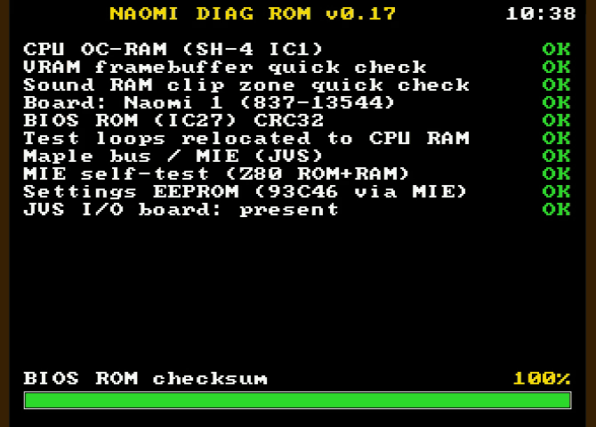

# NaomiDiag

> **En cours de développement.** Certaines fonctions n'ont pas encore été
> testées sur du vrai matériel. Mais je travaille dessus aussi vite que je
> peux :-)

ROM de BIOS de diagnostic pour les cartes d'arcade **SEGA Naomi** et
**Naomi 2**. Elle remplace le BIOS d'origine dans le support IC27 et teste
les composants de la carte un par un, en rapportant les résultats sur trois
canaux — **série (SCIF)**, **écran (VGA)** et **voix** — sans jamais
dépendre d'une mémoire dont le bon fonctionnement n'a pas encore été prouvé.

Elle a déjà servi à réparer une carte : la ROM a désigné **IC10**, et le
remplacement d'IC10 seul a fait disparaître la panne.

Disponible en **anglais** et en **français**, texte et voix localisés.
Les ROMs pré-compilées prêtes à graver sont sur la page
[**Releases**](https://github.com/Guimli/NaomiDIAG/releases/latest) —
téléchargement direct :
[NaomiDIAG_EN.bin](https://github.com/Guimli/NaomiDIAG/releases/latest/download/NaomiDIAG_EN.bin)
·
[NaomiDIAG_FR.bin](https://github.com/Guimli/NaomiDIAG/releases/latest/download/NaomiDIAG_FR.bin).

> English: see [README.md](README.md).

### Une exécution, avec une panne



Ligne de données D5 maintenue à 0 sur une partie de la RAM CPU, sous MAME.
Le test cellule échoue et la ROM nomme la puce : D5 est dans la moitié basse
du mot de 64 bits, elle appartient donc à la paire de mot pair — **IC9**,
jamais la paire impaire. La bordure clignotante est le battement d'activité,
qui pulse tant que la ROM est vivante.

L'exécution complète est sur la page des releases :
[**NaomiDIAG_EN_IC9_fault.mp4**](https://github.com/Guimli/NaomiDIAG/releases/latest/download/NaomiDIAG_EN_IC9_fault.mp4)
— 95 secondes, tous les tests, **avec le son**, pour entendre la panne
annoncée autant que la lire. GitHub ne lit pas une vidéo hébergée dans un
dépôt (il supprime la balise `<video>`) : d'où le GIF muet ci-dessus et le
téléchargement pour la version sonore.

## Trois canaux de sortie simultanés

Chaque résultat de test est rapporté **en même temps sur tous les canaux
alors disponibles** — série, puis série + audio, puis série + audio + vidéo
— pour que l'opérateur puisse au choix regarder, écouter ou capturer le
journal. À mesure qu'un résultat est produit, il est imprimé sur le SCIF,
énoncé à voix haute et affiché à l'écran VGA, ensemble.

L'ordre d'activation des canaux suit ce dont chacun a besoin :

- Le **port série SCIF** est la seule sortie entièrement interne au SH-4 :
  il fonctionne dès le reset **sans aucune RAM externe**, c'est le canal
  primaire, toujours disponible.
- L'**audio** a besoin de la RAM son (derrière l'AICA) et la **vidéo** de la
  VRAM (derrière le PowerVR) ; la petite zone de chacune qu'utilise son
  canal est contrôlée d'abord, et chaque canal ne s'active qu'une fois sa
  zone validée. Les tests complets de ces mémoires viennent plus tard. Quand l'audio
  s'active, il rejoue d'abord tous les résultats déjà acquis, puis rapporte
  en direct.

Comme le son et la vidéo sont activés avant le long test de la RAM
principale, la machine ne paraît jamais figée pendant ce test d'environ une
minute — l'écran affiche déjà les résultats précédents et le SCIF imprime la
progression passe par passe.

Les rapports vocaux sont bloquants, avec au moins une seconde de silence
entre deux messages pour éviter tout chevauchement.

Les clips sont stockés en **ADPCM Yamaha 4 bits** et remis à l'AICA sous
cette forme (`PCMS=2`), qu'elle décode en matériel. C'est un gain sec de 4:1
sur l'EPROM, sans décompresseur, sans tampon intermédiaire et sans coût
processeur — les octets sont copiés en RAM son exactement tels qu'ils sont
en ROM. Le build français complet est passé de 98 % de l'EPROM à 29 % ;
avec les clips ajoutés depuis (puces Naomi 2, carte JVS, lignes de données),
un build complet
occupe environ 50 %.

## Ce qui est testé

La **suite de démarrage** s'exécute seule, dans cet ordre. L'écran et le
haut-parleur sont vivants bien avant que les mémoires qui les portent soient
intégralement testées : chaque canal est amorcé sur la petite région qu'il
utilise réellement, si bien que les résultats sont rapportés au fil de l'eau.

1. **Cœur SH-4** — le cache est configuré en RAM interne et auto-testé ;
   il sert aussi de pile/`.bss` à toute la ROM (aucune RAM externe utilisée
   avant d'être validée).
2. **Amorçage de l'écran et du haut-parleur** — contrôle rapide de la zone
   de VRAM qu'utilise l'image et de la zone de RAM son d'où jouent les
   clips. Chaque canal ne s'active que si sa zone passe ; le haut-parleur
   rejoue alors tous les résultats déjà acquis. L'image vit dans TEX0 ; si
   cette zone échoue, la même zone de TEX1 — les quatre autres puces, 8 Mo
   plus loin dans la même fenêtre — est contrôlée et, si elle est saine,
   porte l'écran à la place (`VRAM framebuffer TEX1 (secours)`). La bordure
   témoin d'activité n'en dépend pas : sa couleur est un registre du
   PowerVR, pas la VRAM.
3. **Identification de la carte** — Naomi 1 ou Naomi 2 par l'identifiant de
   la puce Elan (`E1AD0000` sur Naomi 2, confirmé sur une vraie carte). Sur
   une Naomi 1, cette lecture tombe dans une zone non peuplée et est supposée
   rendre le bus flottant ; `CFG_BOARD_MODEL=1` l'évite, `=2` sélectionne
   une Naomi 2 connue — voir [PVR_B_ACCESS.md](docs/PVR_B_ACCESS.md).
4. **Relocalisation des boucles de test** — les boucles de test mémoire sont
   recopiées dans un bloc de 8 Ko de RAM CPU, testé d'abord, et exécutées
   de là en cache (voir
   [Où s'exécutent les boucles de test](#où-sexécutent-les-boucles-de-test)).
5. **EPROM BIOS (IC27)** — auto-contrôle CRC32. Il s'exécute juste après la
   relocalisation pour que sa boucle tourne elle aussi en cache depuis la
   RAM CPU : seuls les 2 Mo de données traversent encore le bus de l'EPROM.
   Sans bloc validé, il s'exécute depuis l'EPROM comme avant.
6. **Bus Maple / MIE** (Z80 315-6146) — requête de version + auto-test
   d'usine.
7. **EEPROM des réglages** (93C46 via MIE) — lue, et ses deux copies
   vérifiées par CRC. Nécessite d'abord le téléversement d'un programme Z80
   dans le MIE (`src/mie_prog.z80`), qui reste ensuite résident et sert
   aussi les boutons de la carte et les DIP switches (tous deux rapportés
   sur la console série).
8. **Carte I/O JVS** — le même programme est un maître JVS : il
   réinitialise le bus, donne l'adresse 1 à la carte, et rapporte son
   identifiant, ses révisions et ses entrées (joueurs, contacts,
   monnayeurs, voies analogiques). Si aucune carte ne répond, elle est
   rapportée *absente*, pas en panne.

   Les étapes 6 à 8 ont lieu ici, avant les tests mémoire, sur le bloc
   qualifié à l'étape 5 : les boutons peuvent ainsi interrompre la partie
   longue de la suite. Sur une carte où aucun bloc n'est qualifié, elles
   attendent le test de la RAM CPU et sont ignorées s'il échoue.
9. **RAM CPU principale** (SDRAM, 16/32 Mo, IC9/IC10/IC11S/IC12S) — d'abord
   un test bus de données (walking-ones) et un test bus d'adresses, puis
   **trois phases**, annoncées `passe n/3` et menant chacune la barre de
   progression de 0 à 100 % :
   - **1/3** — écriture de `0x55555555` (0101…) sur toute la zone, puis
     relecture complète et comparaison ;
   - **2/3** — écriture de `0xAAAAAAAA` (1010…) sur toute la zone, puis
     relecture et comparaison ;
   - **3/3** — écriture d'un flux pseudo-aléatoire, puis relecture et
     comparaison mot à mot. Avec `CFG_RAM_CRC=1`, un CRC32 conservé dans un
     registre CPU est aussi accumulé des deux côtés et comparé (voir
     [Compilation](#compilation)).

   Une panne est rapportée par puce, et un échec fait déclarer la RAM
   principale inutilisable dans le résumé. Si **toute** la RAM CPU est
   défectueuse, le programme continue depuis le cache du SH-4 (OC-RAM) et
   effectue tous les tests ne nécessitant pas la RAM principale.
10. **VRAM** — 16 Mo en huit puces de 16 Mbit autour du circuit graphique,
    testées par la fenêtre 32 bits en deux régions de 8 Mo, TEX0
    (IC16/18/20/22) et TEX1 (IC17S/19S/21S/23S), avec les mêmes tests de
    bus et les trois phases. Dans une région, une puce est une moitié de
    4 Mio et une moitié de 16 bits de données (voir
    [Diagnostic TEX et PVR-A/B](#diagnostic-tex-et-pvr-ab)).
11. **RAM son** (IC35, 8 Mo, derrière l'AICA IC33 sur le bus G2), mêmes
    tests, chaque accès cadencé par la FIFO du bus G2.
12. **Naomi 2 uniquement** — VRAM du PVR-B (16 Mo, IC111 à IC118S) une fois
    ses fenêtres reconnues indépendantes de celles du PVR-A, et RAM Elan
    (32 Mo, IC106/107/108S/109S) ; voir
    [plus bas](#accès-au-pvr-b-et-ram-elan).
13. **NVRAM de sauvegarde (IC29)** — test non destructif
    (sauvegarde/restauration).
14. **RTC** (interne à l'AICA, IC33) — non destructif : le compteur doit
    avancer d'une valeur plausible en 2,2 s. Un échec est mesuré une
    seconde fois, pour distinguer une horloge figée (deux fois immobile),
    irrégulière (immobile puis repartie) ou une lecture aberrante (saut ou
    retour en arrière) ; le port série imprime chaque lecture brute. Sa date
    est un contrôle à part : avant 2026, elle ne peut pas être celle du jour
    — pile HS ou horloge jamais réglée — et elle a sa propre ligne
    (`Date RTC (2026 ou apres)`).
15. **EEPROM numéro de série** (IC31, 93C46 sur GPIO du SH-4) — lecture +
    contrôle du contenu.
16. **Intégrité du code relogé** — les boucles relogées ont tourné depuis la
    RAM même qu'on testait : elles sont relues et comparées à la copie en
    ROM. À l'écran seulement en cas d'échec ; toujours sur le port série.

Les **actions opérateur** sont au menu opérateur (voir
[Menu opérateur](#menu-opérateur)) : soit elles écrivent quelque part,
soit elles durent assez pour n'avoir rien à faire devant le rapport.

- **Boucles RAM** (`c`, `v`, `s`) — le test RAM CPU, vidéo ou son, passe
  après passe, pour les pannes intermittentes.
- **Carte DIMM** (`d`) — vidage des registres et contrôle de stabilité en
  lecture, puis le test destructif de la SDRAM par DMA G1 ; `f` identifie
  la flash du firmware DIMM (voir [Carte DIMM](#carte-dimm)).
- **Test des entrées JVS** (`j`) — chaque entrée de la carte I/O, en direct.
- **Mire vidéo** (`m`) — barres de couleur, quadrillage, échelle de gris,
  rampes par composante, plages de pureté et damier d'un pixel, pour le
  moniteur et l'étage de sortie vidéo.
- **Cartouche** (`g`) :
  - **Puce de sécurité** (X76F100) — présence par response-to-reset.
  - **Contenu** — identifie le jeu dans une base embarquée de tous
    les jeux cartouche Naomi/Naomi 2 connus (192 jeux plus une variante de
    dump, 2318 IC) et vérifie
    chaque puce ROM par SHA-1, en nommant l'IC fautive par sa sérigraphie.
    L'identification lit la première puce en flux et prend un instantané du
    SHA-1 à chaque taille de première ROM connue : la cartouche est nommée
    sans avoir à la hacher entièrement. Les puces sont hachées **en brut**,
    sans déchiffrement, de sorte que les empreintes sont celles des dumps
    MAME. Une cartouche qui ne correspond à rien est signalée *contenu
    inconnu* et non défectueuse — ce peut être simplement un dump absent de
    cette base — et le test des lignes de données ci-dessous s'exécute quand
    même, une ligne morte étant l'une des raisons pour lesquelles une
    cartouche connue ne correspond plus.
    Le calcul SHA-1 est écrit en assembleur SH-4 (environ 31 instructions
    par octet, lecture de la cartouche comprise) et lit directement le port
    de la cartouche ; il s'exécute en cache depuis la RAM CPU, avec les
    boucles de test mémoire relogées. **Sans bloc de RAM CPU validé, la
    vérification du contenu est sautée** et le log série l'indique : depuis
    l'EPROM elle prendrait environ 9 s par Mo, 20 minutes pour un jeu moyen
    (132 Mo) et plus d'une heure pour le plus gros (512 Mo). La puce de
    sécurité et les lignes de données restent testées. L'écran affiche
    alors `SHA1 cartouche (RAM CPU HS)  NON TESTE` en orange et la voix
    annonce « Cartouche de jeu, contenu non vérifié, mémoire principale,
    défectueuse ».
    Les puces sont nommées d'après les fichiers MAME, dont l'extension est
    la position sérigraphiée (`mpr-23083.ic31` → IC31) ; `ic8.bin` donne
    IC8, un `.18` seul donne IC18, et les cartouches développées par Namco
    gardent leur position dans la grille du PCB (`maz1ma1.4m` → 4M). Une
    puce que MAME charge deux fois n'est hachée qu'une fois, et un dump
    alternatif (IC22 `_alt` de F355 Challenge 2) est un second contenu
    connu pour cette puce.
    À l'écran, le jeu identifié a sa propre ligne, suivie de **toutes les
    puces du jeu, quatre par ligne** (`IC22 OK  IC1 HS  IC2 ABS …`) : OK en
    vert, HS (contenu faux) et ABS (muette, ou miroir d'une autre puce) en
    rouge, `--` pour une puce présente mais non hachée (builds QUICK).
    La cartouche est lue par **DMA G1 en double tampon** : les 8 Ko suivants
    arrivent dans un tampon pendant que le calcul hache les 8 Ko précédents
    dans l'autre, le bus et le CPU travaillent en même temps. Le chemin DMA
    n'est retenu qu'après que 8 Ko lus par DMA sont identiques aux mêmes 8 Ko
    lus par le port ; un transfert qui n'aboutit pas bascule sur le port, et
    une puce trouvée mauvaise (ou une cartouche inconnue) par le DMA est
    relue par le port avant tout verdict. Le log donne le temps de 8 Ko par
    les deux voies. *Pas encore validé sur vrai matériel* (MAME ne simule
    aucune des deux vitesses).
  - **Complétude du jeu de ROM** — une fois le jeu identifié,
    **l'ensemble des puces nécessaires à ce jeu** est vérifié : chaque mask
    ROM de la fiche de la base est sondée et le résultat est affirmé
    explicitement (`jeu de ROM : 13 / 13 puces presentes`). Une puce qui
    répond un 0xFFFF/0x0000 constant partout est signalée comme *ne
    répondant pas* (absente, mal enfichée, morte) plutôt que comme contenu
    erroné, et une puce renvoyant les mêmes octets qu'une autre est
    signalée comme miroir d'adresses — un support vide auquel une puce
    voisine répond. La présence est vérifiée sur toutes les puces même en
    build QUICK ; seul le hachage est réduit.
  - **Lignes de données** — statistiques par broche sur le bus
    16 bits : proportion de 1 lue par chaque ligne (une ligne qui ne bascule
    jamais est figée), plus la comparaison de deux lectures des mêmes
    adresses — tout bit qui diffère trahit une ligne instable, signature
    d'un transceiver fatigué ou d'un connecteur encrassé. Ce test tourne
    même quand le jeu n'est pas identifiable, puisqu'une ligne morte est
    précisément ce qui empêche l'identification.

Les pannes RAM sont rapportées par composant : masque de bits, voies de
données concernées, et désignateur IC sérigraphié (ex.
`RAM CPU 1 (IC9) DEFECTUEUX`). Les puces de VRAM et de RAM Elan sont
désignées comme *voie suspecte (puce ou connexions)*. À l'écran, les puces
fautives s'affichent en rouge sur la ligne même de l'échec, juste avant
`ECHEC` (`SDRAM test cellules   IC9 IC12S ECHEC`) ; un libellé trop long pour
leur laisser la place perd sa parenthèse.

Une panne de RAM CPU est aussi examinée pour une **ligne de données
coupée**. Chaque bit fautif est sondé sur 64 adresses réparties dans la zone
testée, sur la parité de mot où il a échoué : toutes écrites, puis un leurre
de polarité opposée pour qu'une ligne flottante ne se contente pas de
garder la dernière valeur envoyée, puis toutes relues, avec le bit à 0 puis
à 1. Faux sur 60 ou plus, c'est une ligne et non une cellule : elle a sa
propre ligne à l'écran et à la voix — `Ligne D5 coupee sur IC9 DQ5`,
« Ligne D, cinq, coupée sur, I C neuf, D Q, cinq » — et le port série précise
comment elle se lit (toujours 0, toujours 1, ou flottante). La ligne est
nommée deux fois : d'abord comme le bus 64 bits du SH-4 la porte (un mot
pair est D0-D31, un mot impair D32-D63), puis comme la broche de données
de la puce elle-même, DQ0-DQ15, celle à sonder sur le boîtier.

Les **lignes d'adresse** sont parcourues puce par puce sur chaque mémoire :
une étape ne compte que si une voie entière de 16 bits d'une cellule relit
la valeur écrite à l'autre adresse — deux adresses qui tombent sur une même
cellule — si bien qu'une panne de données n'est pas prise pour une ligne
d'adresse. Sur la RAM CPU, le parcours couvre aussi le mot impair de
32 bits, que le test d'adresses classique ne touche jamais, et le bit CPU
est nommé par la broche de SDRAM qu'il emprunte, d'après la table de
multiplexage du SH-4 (manuel matériel Renesas SH7750, annexe F : table 9
pour 32 Mo, table 13 pour 16 Mo). Une même broche porte un bit de colonne
et un bit de ligne :

| Bit d'adresse CPU (octets) | Broche SDRAM (32 Mo) | Broche SH-4 |
|---|---|---|
| 3-10 | A0-A7, colonne | A3-A10 |
| 11-20 | A0-A9, ligne | A3-A12 |
| 21, 22 | A10, A11, ligne | A13, A14 |
| 23, 24 | BA0, BA1, banque | A15, A16 |

Les lignes d'adresse sont communes aux quatre puces :
`Adresse A5 coupee sur IC10` (« Ligne d'adresse A, cinq, coupée sur, I C
dix ») désigne la broche de cette puce, `Adresse BA0 coupee, 4 puces` la
piste commune ou le SH-4. Le port série ajoute la broche du SH-4 et les
bits CPU derrière la broche de SDRAM. La VRAM, la RAM Elan et la RAM son
sont derrière des contrôleurs dont le multiplexage n'est pas documenté :
pour elles, le rapport nomme le bit CPU et les puces touchées :
`Bit d'adresse 12 fautif sur IC21`. Une puce qui se replie sur de nombreux
bits à la fois est laissée aux tests de données et de cellules : c'est une
puce ou une voie morte, pas des lignes d'adresse coupées.

La barre de progression se retire après les mémoires Naomi 2 : à partir de
là plus rien ne se mesure — la NVRAM, le RTC et l'EEPROM série répondent par
oui ou par non — et les lignes qu'elle occupait reviennent au rapport.

### Temps restant

Le coin supérieur droit de l'écran décompte le temps jusqu'à la fin de la
suite de démarrage, et le port série imprime l'estimation dès que le plan
est connu. Chaque étape a une durée tirée du log série d'une vraie Naomi 2 en v0.16
dont tous les tests fonctionnent (le log « après » de la PR #3), résultats
parlés compris ; seul le cas sans RAM CPU pour les boucles est extrapolé :

| Étape | Boucles relogées | Pas de RAM CPU pour les boucles |
|---|---|---|
| Amorçage écran + haut-parleur | 0:29 | 0:29 |
| Identification de la carte | 0:04 | 0:04 |
| Relocalisation des boucles | 0:37 | 0:31 (jusqu'à 128 blocs balayés depuis la ROM) |
| CRC du BIOS | 0:02 (estimation, à mesurer) | 0:04 |
| MIE, EEPROM des réglages, JVS | 0:19 | sautée |
| RAM CPU | 0:52 | 12:39 |
| VRAM TEX0 + TEX1 | 0:53 | 6:25 |
| RAM son | 8:22 | 8:22 (jamais relogée) |
| Naomi 2 : PVR-B + RAM Elan | 1:31 | 19:00 |
| NVRAM, RTC, EEPROM série, fin | 0:29 | 0:29 |
| **Total Naomi 1** | **12:07** | **29:04** |
| **Total Naomi 2** | **13:38** | **48:04** |

- Cette exécution a duré 13:42. Le total Naomi 1 est la même exécution
  sans le PVR-B ni la RAM Elan. TEX1 y est mesurée plus lente que TEX0,
  8,9 s contre 4,1 s par passe.
- Sans bloc de RAM CPU, les boucles tournent depuis l'EPROM de démarrage.
  Le contrôle rapide de la VRAM le fait toujours : 3 passes sur 600 Ko en
  14,5 s, soit 7,9 s par mégaoctet-passe, environ 14 fois le rythme en
  cache. La lecture des instructions domine alors : ce rythme est appliqué
  à chaque mémoire que testent les boucles.
- Le décompte se corrige en route : dans une étape mémoire il suit la
  progression des passes, la durée mesurée du contrôle rapide de la VRAM
  recale le cas ROM, et le test de la RAM CPU recale les étapes mémoire
  suivantes. Sans audio, le temps des annonces vocales est retiré.


### Où s'exécutent les boucles de test

Le SH-4 démarre en P2, fenêtre que le matériel ne cache jamais : chaque
instruction est un cycle de bus vers l'EPROM de démarrage. Lier toute la ROM
en P1 (l'alias caché de la zone de démarrage) a été essayé sur matériel réel
et la carte le refuse — écran noir avant la première instruction visible —
ce qui rejoint le BIOS d'origine, qui ne s'exécute jamais en cache depuis la
ROM.

L'exécution cachée depuis la SDRAM est tout autre chose : c'est là que tourne
chaque jeu Naomi. Les boucles de test mémoire et la relecture de localisation — environ 500 octets, où
passe la quasi-totalité du temps — sont donc recopiées au démarrage dans les 8 Ko
de RAM CPU et exécutées depuis là, en cache, le reste du programme demeurant
en ROM.

Les quatre puces de RAM CPU sont entrelacées par voie de données et non par
plage d'adresses — IC9/IC10 portent les mots pairs, IC11S/IC12S les impairs —
si bien que tout bloc les traverse toutes. Les blocs sont balayés du sommet
vers le bas et le premier sain est retenu : cela immunise contre un défaut
localisé (ligne ou colonne défaillante dans une puce) mais pas contre une
puce morte sur toute sa plage, auquel cas aucun bloc ne passe et les copies
en ROM restent utilisées. Un bloc en échec est signalé comme la mémoire
défectueuse qu'il est, non passé sous silence.

Une puce morte sur toute sa plage est décidée en trente-deux accès par le
test du bus de données, avant tout balayage : les 128 blocs échoueraient pour
la même raison, et un mégaoctet de test futile depuis l'EPROM retarderait la
seule chose que l'opérateur a besoin de savoir. Dans tous les cas le rapport
nomme la fenêtre depuis laquelle les boucles s'exécutent réellement —
`8Cxxxxxx`/`8Dxxxxxx` pour la RAM CPU en cache, `A0xxxxxx` pour l'EPROM de
démarrage — relue depuis le pointeur qui sera effectivement appelé et non
depuis un indicateur.

Cette fenêtre est testée par la suite complète motifs + pseudo-aléatoire
avant qu'on y copie quoi que ce soit, et la mémoire sous test reste adressée
par P2 : le chemin de données demeure non caché et la couverture est
conservée. Si aucune RAM utilisable n'est trouvée, les pointeurs continuent
de viser les copies en ROM et le diagnostic est lent plutôt qu'absent — ce
qui est précisément le cas d'une carte à diagnostiquer. `RELOC=0` désactive
complètement le mécanisme.

## Diagnostic TEX et PVR-A/B

Les erreurs VRAM sont associées aux voies IC selon le calcul du BIOS
EPR-23608C : moitié de **4 Mio** et bits **D0–D15 / D16–D31**, et non parité
du mot. Les tables, preuves de désassemblage, limites et brochages sont
regroupés dans [ADDRESS_MAP.md](docs/ADDRESS_MAP.md).
Un IC nommé désigne une **voie suspecte : puce, connexions ou contrôleur**,
pas une preuve de panne interne de la RAM.

### Lire les erreurs

- Le masque de données est le XOR attendu/lu. `00000200` désigne D9 ;
  `00000300` désigne D8 et D9. À `A5C00000`–`A5FFFFFC`, ces bits sont
  associés à **IC21** par le BIOS. Les essais réels avec DQ9, puis DQ8/DQ9
  coupées ont reproduit ces erreurs. Le pinout fourni donne DQ8 = 39 et
  DQ9 = 40 ; il ne prouve pas à lui seul le câblage CPU vers DQ.
- Le masque du test d'adresses indique les **étapes en échec**, pas des
  broches d'adresse défectueuses. Des erreurs de données peuvent produire
  `007FFFFC`. Un test du bus de données à une adresse peut aussi réussir
  alors que des cellules ailleurs dans la région échouent.
- Après un échec du bus de données ou d'adresses, le diagnostic teste des
  cellules isolées (motifs alternés, bits marchants à 1 et à 0, deux lectures),
  puis des paires d'adresses avec deux ordres d'écriture, deux polarités et
  deux répétitions. Les adresses couvrent le début, la fin et des offsets
  puissances de deux ; ce sondage ne remplace pas le test complet.
- `VRAM readback failure` conserve les valeurs lues et relues des deux
  cellules. Un XOR initial nul peut donc accompagner une erreur à la
  relecture. `VRAM coupling candidate` exige que les cellules réussissent
  isolément puis reproduisent le motif de l'autre dans les huit essais.
  Les bits indiqués sont des **bits d'adresse CPU en octets**, pas des
  broches physiques A0–A11. Un masque de couplage nul signifie qu'aucun
  couplage n'a été confirmé par ces essais.

Les 32 premiers événements du diagnostic sont affichés ; les compteurs et
masques incluent les suivants. Les passes complètes conservent huit détails
mais comptent et associent aussi les erreurs suivantes aux IC. Une erreur
non retrouvée à la relecture laisse plusieurs IC candidats dans la plage
concernée ; un sondage sans erreur n'annule pas un échec intermittent.

### Relecture après 90 %

Les passes de vérification rapides disent seulement si quelque chose a
différé. Si c'est le cas, une relecture de la région localise les mots
fautifs ; elle affiche « Erreur detectee, localisation VRAM » (ou RAM CPU)
avec sa propre progression et vérifie l'arrêt tous les 1024 mots.

Cette relecture est écrite en assembleur et vit dans le bloc relogé : elle
tourne en cache depuis la RAM CPU quand un bloc a été qualifié, depuis
l'EPROM sinon. Elle enregistre en entier les huit premiers mots fautifs,
pour les lignes de détail ; ensuite elle ne s'arrête que sur un mot qui
apporte un bit de données pas encore vu dans sa moitié de 4 Mio et sur sa
parité de mot — peut-être une autre puce — et se contente de compter les
autres. Le total d'erreurs et les puces désignées restent exacts.

C'est décisif pour une ligne de données coupée, qui fait échouer chaque mot
de sa moitié. Sur une vraie Naomi 2 avec DQ9 coupée sur IC21, l'ancienne
relecture — du C depuis la ROM, chaque mot fautif enregistré — prenait
environ 3 min 20 s par passe en échec, et TEX1 durait 7 minutes au lieu de
17 secondes. La relecture coûte maintenant à peu près une lecture de plus
de la région : quelques secondes en cache, bien moins d'une minute depuis
la ROM.

### Accès au PVR-B et RAM Elan

Avant d'écrire dans le PVR-B, le contrôle d'accès vérifie que les fenêtres
A et B sont indépendantes. Chaque cellule sondée est d'abord écrite et
relue seule ; les bits qui y échouent sont une panne propre à cette cellule
et sont exclus de la comparaison suivante, où les quatre cellules portent
des valeurs distinctes et où un changement ne peut venir que d'une écriture
dans une autre fenêtre. Une ligne de données coupée sur une puce — le cas
DQ9 ci-dessus — ne bloque donc plus les tests PVR-B et Elan : elle est
signalée par le test RAM de sa propre région. Un miroir ou une diffusion
les bloque toujours (code 4), comme une cellule trop abîmée pour juger
(code 5 sur A, 6 sur B). **Non testé ne signifie ni sain ni défectueux.**

La RAM Elan est la mémoire propre de l'Elan, pas une fenêtre sur l'un des
GPU : elle est testée quel que soit le verdict d'accès au PVR-B, sauf si
l'Elan lui-même ne répond pas. Ses puces suivent la table POLY du BIOS :
mots 32 bits pairs et impairs des 16 premiers Mio = **IC106** et **IC107**,
des 16 derniers = **IC108S** et **IC109S** — voir
[ADDRESS_MAP.md](docs/ADDRESS_MAP.md). La boucle `v` couvre le PVR-B et la
RAM Elan sur Naomi 2, aux mêmes conditions. Voir
[PVR_B_ACCESS.md](docs/PVR_B_ACCESS.md) pour la séquence et tous les codes.

### Communication Maple / MIE sur matériel réel

Les tampons DMA Maple sont réservés dans un bloc de RAM CPU validé, souvent
près du sommet des 32 Mo. La protection `MDAPRO` est calculée à partir des
deux tampons, avec des bornes inclusives de 1 Mio. L'ancienne constante
`0x6155404F` ne couvrait que les premiers 16 Mo : les tampons en RAM haute
étaient hors plage, ce qui pouvait produire un faux « MIE sans réponse ».
Le [pilote libnaomi](https://github.com/DragonMinded/libnaomi/blob/main/libnaomi/maple.c)
utilise le même encodage des bornes. MAME ignore ce registre de protection ;
une réussite dans l'émulateur ne valide donc pas ce point sur la carte.

En cas d'échec de détection, une trace par port fournit `desc`, `rx`,
`mdapro` (valeur programmée), `mdst`, le mot de réponse et `isterr_before` /
`isterr_after`. Ces derniers sont des instantanés bruts : ils peuvent contenir
des erreurs anciennes ou étrangères à Maple et ne sont pas effacés.
Le champ `status` distingue :

| État | Signification |
| --- | --- |
| `invalid-request` | Adresse, alignement ou taille de requête non valide |
| `busy-timeout` | Le transfert précédent reste actif ; tampons non réutilisés |
| `dma-timeout` | Le nouveau transfert reste actif après 100 ms |
| `rx-unchanged` | DMA terminé, mais le marqueur du tampon est resté intact |
| `no-response` | Mot de réponse indiquant une absence de réponse |
| `invalid-version-reply` | Réponse reçue, mais différente d'une version MIE valide |

Un échec de communication ne désigne pas automatiquement un MIE défectueux.
Les tests hôtes (`sh tools/test_maple.sh`) vérifient les bornes DMA, la RAM
haute, les délais, le retour du compteur temporel à zéro et les réponses
incorrectes.

Validation sur une PCB Naomi 2 fonctionnelle, avec les boutons TEST/SERVICE
de la **filter board** : communication MIE, auto-test, chargement du programme
Z80 et navigation dans le menu série confirmés sur matériel réel.
Réponse observée avant le chargement du programme Z80 (espaces conservés) :

```text
MIE on maple port 0, resp cmd 0x00000083
MIE version: "315-6149    COPYRIGHT SEGA E"
Bus Maple / MIE (JVS) ........ OK
  MIE self-test status word: 00000000
Auto-test MIE (Z80 ROM+RAM) ........ OK
  programme Z80 charge dans le MIE
  DIP SW1 : 1=31 kHz  2=OFF  3=ON  4=OFF   (port brut 000000FB)
  Boutons carte : TEST relache, SERVICE relache
```

`0x83` est la réponse à la requête de version `0x82` ; `00000000` est le
résultat réussi de l'auto-test. La chaîne ci-dessus est celle affichée par
notre lecteur de réponse, pas une exigence d'identification ni une preuve
du marquage physique du composant. Le lecteur affiche le contenu de la
première trame ; il ne reconstitue pas une éventuelle suite du texte de
version. Les positions DIP et l'état des boutons sont propres à cet essai,
pas des valeurs obligatoires pour une carte saine. Ce retour valide les
boutons de la filter board, pas les commandes d'une carte I/O JVS externe.

## Menu opérateur

Le menu affiche ses huit choix sur VGA et sur la console série. Sur le port
série, chaque ligne indique la touche directe (`c`, `v`, `s`, `d`, `g`, `f`, `j`, `m`) ;
le repère `>` désigne le choix courant. Chaque appui sur TEST réaffiche la
liste avec la nouvelle sélection, et SERVICE la lance. Aucun écran VGA ni
support des séquences ANSI n'est nécessaire pour suivre la navigation.

Pendant la suite, dès que le programme du MIE lit les boutons, une ligne
bleue, une ligne vide au-dessus du libellé du pourcentage, indique lesquels
l'arrêtent : `TEST ou START : arret et menu operateur`. Elle s'efface quand
le rapport atteint sa ligne.

Une fois la suite terminée, la dernière ligne de l'écran — là où était la
barre de progression — indique comment y accéder, en blanc sur bleu :
`TEST ou START : menu operateur` (le TEST de la carte, PSW1, ou le START du
joueur 1 de la borne ; le SERVICE de la carte, PSW2, et le TEST de la borne
marchent aussi).

La suite de démarrage n'est pas la fin. `a` ou une touche du menu au port
série, un bouton de la carte (**TEST** ou **SERVICE**), ou le **TEST** de la
borne et le **START** du joueur 1 dès que la carte JVS a répondu, arrêtent la
suite : le test en cours s'arrête au bloc suivant et **ne rend aucun
verdict** sur la partie effectuée — ses phases se terminent par
`interrompue`, pas par `ok` — et la suite ne reprend pas. `a` mène au
rapport, un bouton ouvre le **menu opérateur**, et une touche du menu (`c`,
`v`, `s`, `d`, `g`, `f`, `j`, `m`) lance directement son action. `h` affiche l'aide sans rien
interrompre ; les autres touches sont ignorées.

Les boutons exigent d'abord le téléversement d'un petit programme Z80 dans le
MIE — le firmware d'usine du 315-6146 répond à quatre commandes Maple, et
lire les boutons n'en fait pas partie. Ce téléversement a lieu juste après la
relocalisation des boucles de test, avant les tests mémoire, dès qu'un bloc
de RAM CPU a été qualifié pour accueillir les tampons DMA du Maple ; le
programme reste ensuite résident. Les boutons peuvent donc interrompre la
partie longue de la suite. Sur une carte sans bloc utilisable, l'étape MIE
revient à son ancienne place, après le test de la RAM CPU.

Le **TEST** de la borne et le **START** du joueur 1, lus sur la carte I/O
JVS, jouent le rôle du **TEST** et du **SERVICE** de la carte dès que la
carte I/O a répondu.

Le maître JVS vit dans le même programme Z80. Il pilote l'UART de type
16550 du MIE à 115200 bauds (diviseur 8, le réglage du BIOS d'origine),
commute l'émetteur RS-485 autour de chaque trame comme le fait ce
programme, et interroge la carte I/O de lui-même entre deux paquets Maple,
un octet à la fois : une requête Maple reçoit toujours sa réponse aussitôt.
Le SH-4 ne fait que lire le résultat, 28 octets par requête.

Touches sur la console série :

| Touche | Action |
|---|---|
| `h` | aide — la seule touche qui n'interrompt jamais |
| `a` | abandonner le test en cours et passer au rapport |
| `c` / `v` / `s` | boucler le test RAM CPU / vidéo / son |
| `d` | test complet de la SDRAM du DIMM |
| `g` | intégrité SHA-1 des flash du jeu |
| `f` | flash du firmware DIMM — identification, et choix d'une version |
| `j` | test des entrées JVS — chaque contact, monnayeur et voie analogique, en direct |
| `m` | mire vidéo |

À l'écran, le menu opérateur liste les mêmes actions : **TEST** (ou le TEST
de la borne) les parcourt en bouclant ; **SERVICE** (ou le **START** du
joueur 1) lance la sélection. Les
trois boucles RAM tournent jusqu'à l'appui sur un bouton et rien d'autre ne
les arrête — c'est le but, une panne intermittente se montrant à la dixième
passe et non à la première. Une seule exception : quand les boutons sont
indisponibles (le MIE n'a jamais répondu au programme téléversé), `a` arrête
aussi une boucle, sinon seul un reset le pourrait. La boucle vidéo couvre
TEX0 et TEX1, plus le PVR-B et la RAM Elan sur Naomi 2, et chaque boucle
nomme une puce défaillante comme le fait la suite de démarrage.

Les actions DIMM, cartouche et flash ouvrent chacune un rapport qui leur est
propre, l'affichent, et attendent **TEST** ou **SERVICE** pour ramener le
menu opérateur.

La mire vidéo montre dix images plein écran à la suite : barres de couleur,
quadrillage pour la géométrie et la convergence, échelle de gris en 16 pas,
rampes rouge, verte, bleue et blanche (un bit du DAC figé s'y voit en
bandes), plages blanche, rouge, verte, bleue et noire pour la pureté, et un
damier d'un pixel pour la bande passante. **TEST** ou une touche série
passe à la suivante ; **SERVICE**, **START**, `a` ou `q` en sort. La bordure
cesse de battre pendant ce temps. La sortie est le 640x480 à 31 kHz de la
ROM : un moniteur 15 kHz n'affiche rien.

Le test des entrées JVS montre chaque entrée que la carte I/O a déclarée :
les contacts système (TEST, TILT1-3), le START, le SERVICE, les quatre
directions et les boutons de chaque joueur, allumés tant qu'ils sont
appuyés ; les compteurs des monnayeurs ; les voies analogiques en
hexadécimal ; et les octets bruts des contacts, pour une carte dont la
disposition diffère. Le port série imprime une ligne dès qu'un contact ou
un compteur change. TEST fait partie des entrées testées, celui de la
borne comme celui de la carte (une ligne `CARTE TEST` montre ce dernier) :
seul le **SERVICE** de la carte, ou une touche série, en fait sortir.

Deux d'entre elles sont à l'initiative de l'opérateur précisément parce
qu'elles ne sont pas sûres sans surveillance : le test SDRAM du DIMM écrase
le jeu qui y est chargé (pas le firmware, qui tourne depuis sa propre RAM),
et l'action flash touche à la flash du firmware du DIMM — en lecture seule
pour l'instant, voir plus bas.

## Compilation

Chaîne d'outils : paquets Debian `gcc-sh-elf` / `binutils-sh-elf`.

```sh
make LANG=EN            # -> NaomiDIAG_EN.bin (texte + voix anglais)
make LANG=FR            # -> NaomiDIAG_FR.bin (texte + voix français)
make LANG=FR QUICK=1    # 1 Mo par passe RAM, pour l'émulateur
make LANG=FR BAUD=115200  # console série à 115200 au lieu de 57600
```

[`src/config.h`](src/config.h) regroupe les options qui relèvent d'une
décision sur la ROM plutôt que d'une variation d'une construction à l'autre.
Le Makefile porte ce qui change à chaque build — `LANG`, `QUICK`, `RELOC`, `BAUD`,
`ROM_BASE` ; l'en-tête porte ce qu'on règle une fois. Tout y reste
surchargeable sans éditer le fichier :

```sh
make LANG=FR CFLAGS_EXTRA=-DCFG_LANE_BEACON=1
```

**`CFG_RAM_CRC`** (désactivée par défaut) rétablit la comparaison CRC32 dans
les tests cellule de RAM. La spécification la demandait, elle est implémentée
et fonctionne — mais elle est démontrablement redondante et coûteuse.
Redondante, parce que la même boucle compare déjà chaque mot à la valeur
attendue : si aucun mot ne diffère, les deux flux d'octets sont identiques et
leurs CRC ne peuvent pas différer. Coûteuse, parce qu'un CRC-32 coûte 20
instructions par mot de 32 bits et qu'il y en a deux — **40 des 59
instructions** de la boucle de relecture, contre **3** pour la comparaison mot
à mot qui fait le travail de détection. Désactivée, la boucle tombe à 17
instructions par mot, environ trois fois plus rapide, sans rien perdre en
détection ni en localisation.

**`CFG_LANE_BEACON`** (désactivée par défaut) active la balise de voies :
après le rapport, elle parcourt les douze tranches de 16 bits des bus RAM CPU
et VRAM, en nommant une à la fois et en la martelant pour qu'un oscilloscope
posé sur les puces révèle laquelle porte quelle voie. C'est un instrument
d'établi pour construire la correspondance voie → désignation, pas une étape
du diagnostic : elle ne se termine jamais, donc le rapport reste affiché mais
la machine ne se stabilise pas. À activer quand vous avez une sonde en main.

**`AUDIO=0`** produit une ROM muette : la table des clips vocaux est
remplacée par un stub et l'image tombe à 6 % de l'EPROM. Cette option est née
quand les clips étaient du PCM 16 bits et ne laissaient de place à rien
d'autre ; depuis leur passage en ADPCM, un build complet occupe environ
50 %, ce n'est donc plus un moyen de faire de la place — c'est pour un
établi où la parole gêne, et ça démarre un peu plus vite. `AUDIO=1` est la
valeur par défaut.

```sh
make LANG=FR AUDIO=0
```

Attention : le shell exporte souvent `LANG=fr_FR.UTF-8`, qui écrase le
`LANG ?= EN` du Makefile. Passez toujours `LANG=` explicitement à **chaque**
`make`, y compris `make mame-rom`, sinon une cible se reconstruit avec
d'autres options.

Une image de 2 Mo est produite, prête à graver sur une EPROM 27C160 (IC27).
Le build refuse toute image dépassant 2 Mo (pas de troncature silencieuse).

La même image 27C160 fonctionne sur Naomi 1 et Naomi 2 (les deux utilisent
un BIOS de 2 Mo) ; la carte est détectée à l'exécution.

Régénérer les sources générées (rarement nécessaire, versionnées) :

```sh
make audio     # ré-génère les clips vocaux (nécessite le venv Piper + sox)
               # TTS -> 22050 Hz mono -> ADPCM (tools/adpcm.py)
make cartdb    # reconstruit la base SHA-1 cartouche depuis `mame -listxml`
make mieprog   # reconstruit src/mie_prog.h depuis le source Z80 (z80asm)
```

## Test sous MAME

```sh
make LANG=FR QUICK=1 mame-rom
mame naomi -rompath ../roms_diag -autoboot_script mame/scif_tap.lua
```

Les scripts MAME sont tous dans [`mame/`](mame). `scif_tap.lua` capture la
FIFO d'émission SCIF du SH-4 et affiche la console série (MAME ne câble pas
le SCIF). Les scripts `*_fault*.lua` injectent des pannes RAM pour les tests
négatifs. Note : la RAM principale est en fastram
sous le DRC, l'injection de panne y nécessite `-nodrc`.

MAME (0.288) n'émule pas le matériel propre à la Naomi 2 : son `naomi2` n'a
qu'un PowerVR, renvoie la fenêtre du PVR-B sur le PVR-A, lit 0 à
l'identifiant Elan et n'a pas de RAM Elan ; la ROM y voit donc une Naomi 1.
`mame/elan_id.lua` simule l'identifiant Elan pour exercer le chemin Naomi 2 :
il aboutit, à juste titre, à un refus d'accès (code 4, le miroir) et à une
RAM Elan en échec. Le maître JVS, lui, se teste : le `naomi` de MAME porte
une carte I/O 837-13551 émulée.

## Notes pour le vrai matériel

- Gravez `NaomiDIAG_xx.bin` sur une 27C160 (IC27). La sortie série est sur
  les broches SCIF en logique 3,3 V — utilisez un adaptateur USB-série
  3,3 V, jamais des niveaux RS-232. Pour savoir où le brancher sur la carte,
  référez-vous au projet [JinGasa](https://github.com/Tchan0/JinGasa) : il
  n'existe que pour dialoguer avec une Naomi par le port série et en
  documente le câblage, ce qu'on ne peut pas dire des brochages qui circulent
  par ailleurs.
- **Réglez le terminal sur 57600 bauds, 8N1, sans contrôle de flux.** La ROM
  l'indique elle-même dans ses premières lignes, dès que la console est active.

  Avec l'horloge périphérique à 50 MHz du SH-4, le débit vaut
  `Pck/(32*(SCBRR+1))`. La ROM utilise `SCBRR2 = 26`, soit un débit réel
  d'environ **57870 bauds, 0,47 % au-dessus de 57600**, validé sur une
  Naomi 2 avec un adaptateur série USB. `make BAUD=115200` produit l'ancien
  réglage : `SCBRR2 = 13`, **111607 bauds, 3,1 % sous 115200** — dans la
  tolérance d'un UART, avec moins de marge.
- Un échec du test cache signifie que le SH-4 lui-même est mort : c'est
  rapporté sur SCIF puis la ROM s'arrête.
- Une exception CPU est signalée puis la ROM s'arrête, sur chaque canal
  disponible et dans cet ordre : d'abord le **port série** (code de cause
  `EXPEVT` et adresse fautive — il n'a besoin d'aucune pile, il sort donc
  même quand c'est la pile qui a lâché), puis une ligne rouge à l'**écran**,
  puis les mots *« Exception du processeur »* au **haut-parleur**. La
  bordure passe au rouge fixe : la machine est arrêtée. Seule une exception
  dans les toutes premières instructions, avant l'installation de la table
  des vecteurs, redémarre la ROM.
- Le ventilateur de la carte DIMM n'est surveillé que par le firmware DIMM.

## État et limites

- Les désignateurs IC ont été **relevés sur la carte** et sont listés dans
  [`docs/ADDRESS_MAP.md`](docs/ADDRESS_MAP.md). Une version antérieure les
  déduisait de l'ordre dans lequel le RAM TEST du BIOS d'origine affiche ses
  numéros ; cette déduction s'est trompée trois fois — dont une inversion
  complète des groupes RAM CPU et RAM GPU — et plus rien ne repose dessus.
- Les voies VRAM suivent désormais le calcul du BIOS EPR-23608C détaillé
  dans [ADDRESS_MAP.md](docs/ADDRESS_MAP.md). Les connexions physiques et
  broches d'adresse restent à vérifier. Le suffixe **S** désigne le verso.
- Pour WORK, IC10 sur D16–D31 du mot pair a été validé par réparation.
  IC9, IC11S et IC12S restent déduits de l'ordre des voies, sans mesure
  individuelle ; la balise de voies permet de les vérifier.
- Chaque puce RAM que la ROM sait nommer a son clip vocal, puces Naomi 2
  comprises (TEX1, PVR-B, RAM Elan), et le suffixe **S** est prononcé : une
  panne sur IC11S s'entend « I C onze S ». La voix est une synthèse Piper :
  l'écran et le port série font foi.
- Les chemins Naomi 2 — identification par l'identifiant Elan,
  initialisation de l'Elan, contrôle d'accès au PVR-B, tests de la VRAM du
  PVR-B et de la RAM Elan — sont couverts par des tests côté PC mais n'ont
  encore tourné sur aucune vraie Naomi 2, et MAME ne peut pas les exécuter.
  La lecture de l'identifiant Elan sur une Naomi 1 n'a pas non plus été
  essayée sur une vraie carte ; `CFG_BOARD_MODEL=1` la supprime.
- Le maître JVS a été vérifié face à la carte I/O 837-13551 émulée par
  MAME. MAME ne modélise ni la temporisation de l'UART ni le sens de la
  ligne RS-485 : ceux-ci suivent le programme du BIOS d'origine et
  demandent encore une vraie borne. Une seule carte I/O est adressée
  (adresse 1) ; une chaîne de plusieurs cartes n'est pas énumérée.

## Carte DIMM

Le protocole de mailbox entre la Naomi et une carte DIMM n'est pas documenté
publiquement. Ce qui a été retrouvé dans le firmware de la carte elle-même
est consigné dans [`docs/DIMM_FIRMWARE.md`](docs/DIMM_FIRMWARE.md) : base de
liaison, fenêtre mailbox vue du DIMM, format de réponse, répartiteur de
commandes, et les deux files de messages VxWorks qui sont derrière.

En résumé, **la mailbox elle-même n'offre rien à une ROM de diagnostic** —
ni identité, ni version, ni test mémoire, ni reflashage. Les trois seules
commandes qu'elle accepte depuis la Naomi sont une sonnette pour un
mandataire de sockets BSD, et l'une des trois ne fait rien.

Ce qui marche passe à côté, par le bus G1 :

- **`d` — test SDRAM du DIMM.** Le GD-DMA de Holly a un bit de sens ; avec
  `SB_GDDIR = 1` la Naomi écrit la RAM système vers le DIMM. La ROM s'en sert
  pour un vrai test mémoire (`0x01010101`, `0x10101010`, CRC-32, délai de
  garde d'une seconde sur le DMA). Il écrase le jeu chargé : réservé au menu opérateur.
- **`f` — flash du firmware DIMM.** La flash s'atteint par le PIO ROM-board
  du G1 avec des commandes AMD. La ROM fait un read-ID, non destructeur, et
  propose un choix entre 3.17, 4.01 et 4.03. **La gravure n'est
  volontairement pas armée.** L'updater de SEGA a été décompilé : il procède
  par un unique effacement de puce suivi de la reprogrammation de l'image
  entière — le filet de secours à deux slots de la carte survit donc à un
  flash réussi, mais pas à un flash interrompu. Cela attend une validation
  sur matériel, pas davantage de lecture.

L'analyse des images de firmware SEGA reste hors de ce dépôt, délibérément.

## Crédits

Initié à partir du projet de BIOS Naomi minimal
[JinGasa](https://github.com/Tchan0/JinGasa). Détails au niveau registre
recoupés avec MAME et libnaomi. Clips vocaux générés avec
[Piper](https://github.com/rhasspy/piper).
