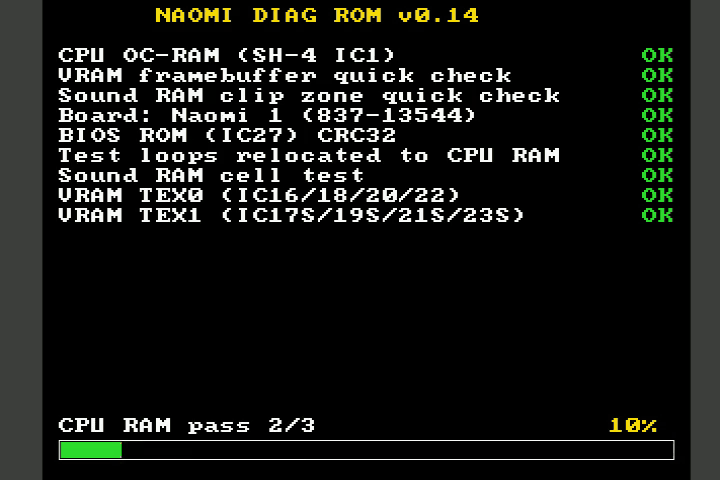

# NaomiDiag

> **Work in progress.** The video RAM IC numbers are wrong. Naomi 2 testing
> is incomplete. And other functions have not been tested yet. But I am
> working on it as fast as I can :-)

A replacement diagnostic BIOS ROM for the **SEGA Naomi** and **Naomi 2**
arcade boards. It replaces the stock BIOS in the IC27 socket and tests the
board's components one by one, reporting results on up to three channels —
**serial (SCIF)**, **on-screen (VGA)** and **spoken audio** — without ever
relying on memory it has not yet proven good.

It has been used to repair a board: the ROM named **IC10**, replacing IC10
alone cleared the fault.

Available in **English** and **French**, text and voice both localized.
Pre-built ROMs ready to burn are on the
[**Releases**](https://github.com/Guimli/NaomiDIAG/releases/latest) page —
direct downloads:
[NaomiDIAG_EN.bin](https://github.com/Guimli/NaomiDIAG/releases/latest/download/NaomiDIAG_EN.bin)
·
[NaomiDIAG_FR.bin](https://github.com/Guimli/NaomiDIAG/releases/latest/download/NaomiDIAG_FR.bin).

> Français : voir [README.fr.md](README.fr.md).

### A run, with a fault



Data line D5 held low across part of the CPU RAM, under MAME. The cell test
fails, and the ROM names the chip: D5 is in the low half of the 64-bit word,
so it belongs to the even-word pair — **IC9**, never the odd pair. The
flashing border is the heartbeat, which pulses for as long as the ROM is
alive.

The full run is on the release page:
[**NaomiDIAG_EN_IC9_fault.mp4**](https://github.com/Guimli/NaomiDIAG/releases/latest/download/NaomiDIAG_EN_IC9_fault.mp4)
— 125 seconds, every test, **with the sound**, so you can hear the fault
announced as well as read it. GitHub will not play a video that lives in a
repository (it strips the `<video>` tag), hence the silent GIF above and the
download for the real thing.

## Three simultaneous output channels

Every test result is reported **at the same time on every channel that is
currently available** — serial, then serial + audio, then serial + audio +
video — so the operator can watch, listen, or capture the log, whichever is
convenient. As each result is produced it is printed on the SCIF, spoken
aloud, and drawn on the VGA report screen together.

The order in which the channels come up follows what each one needs:

- **SCIF serial** is the only output fully internal to the SH-4 CPU: it
  works from reset with **no external RAM at all**, so it is the primary and
  always-available channel.
- **Audio** needs the sound RAM (behind the AICA) and **video** needs the
  VRAM (behind the PowerVR); those memories are tested first, and each
  channel switches on only once its own memory has passed. When audio comes
  up it first replays every result acquired so far, then reports live.

Because sound and video are brought up before the long main-RAM test, the
machine never looks frozen during that ~1-minute test — the screen already
shows the earlier results and the SCIF prints per-pass progress.

Spoken reports are blocking, with at least one second of silence between two
messages so clips never overlap.

The clips are stored as **4-bit Yamaha ADPCM** and handed to the AICA in that
form (`PCMS=2`), which decodes it in hardware. That is a straight 4:1 saving
on the EPROM with no decompressor, no scratch buffer and no CPU cost — the
bytes are copied into sound RAM exactly as they sit in the ROM. The full
French build went from 98 % of the EPROM to 29 %.

## What it tests

In order. The screen and the speaker are alive long before the memories
they live in are fully tested: each channel is brought up on the small
region it actually uses, so results are reported as they land. Items **1-9
and 11-13 are the boot suite** and run on their own.
Items **10 and 14-17 are operator actions** on the menu below: they either
write to something or take long enough that they have no business delaying
the report (see [Operator console](#operator-console)).

1. **SH-4 core** — the operand cache is configured as on-chip RAM and
   self-tested; this is also the stack/`.bss` for the whole ROM (no external
   RAM used until proven).
2. **Board identification** — Naomi 1 vs Naomi 2 (Elan T&L signature + VRAM
   aliasing).
3. **BIOS EPROM (IC27)** — CRC32 self-check.
4. **Main CPU RAM** (SDRAM, 16/32 MB, IC9/IC10/IC11S/IC12S) — first a data-bus
   walking-ones test and an address-bus test, then **three phases**, each
   reported as `pass n/3` and each driving the progress bar from 0 to 100%:
   - **1/3** — write `0x55555555` (0101…) over the whole region, then read it
     all back and compare;
   - **2/3** — write `0xAAAAAAAA` (1010…) over the whole region, then read
     back and compare;
   - **3/3** — write a pseudo-random stream while accumulating a **CRC32 kept
     in a CPU register**, then read the region back recomputing the CRC and
     compare it against the write-side CRC as well as word by word.

   Any single bad cell marks the whole chip (and thus the entire interleaved
   RAM) defective; that RAM is never used for the rest of the program. If
   **all** CPU RAM is bad, the program keeps running from the SH-4 cache
   (OC-RAM) and completes every test that does not need main RAM — only the
   Maple/MIE test, which needs RAM for its DMA descriptors, is skipped.
5. **VRAM** — 16 MB in eight 16 Mbit chips around the graphics chip, tested
   as two 64-bit banks, TEX0 and TEX1 of four chips each, with the same
   three phases.
6. **Sound RAM** (IC35, 8 MB, behind the AICA IC33 on the G2 bus), same
   three phases, every access paced by the G2 FIFO.
7. **Naomi 2 only** — slave PVR VRAM (16 MB) and Elan RAM (32 MB).
8. **Backup SRAM** — non-destructive save/restore test.
9. **RTC** (inside the AICA, IC33) — non-destructive tick check.
10. **DIMM board** — mailbox dump and read stability, then the destructive
    SDRAM test over the G1 DMA. Menu action `d`; `f` identifies the DIMM's
    firmware flash.
11. **Maple bus / MIE** (315-6146 Z80) — version request + factory
    self-test.
12. **Settings EEPROM** (93C46 via MIE) — read and both CRC-checked copies
    verified. Needs a Z80 program uploaded into the MIE first
    (`src/mie_prog.z80`), which then stays resident and also serves the
    board's buttons and DIP switches.
13. **Serial-number EEPROM** (93C46 on SH-4 GPIO) — read + content check.
14. **Cartridge security** (X76F100) — presence via response-to-reset.
    Menu action `g`, with items 15-17.
15. **Cartridge content** — identifies the game against an embedded
    database of every known Naomi/Naomi 2 cartridge (192 games, 2298 ICs)
    and verifies each ROM chip by SHA-1, reporting the failing IC by its
    silkscreen name. Identification streams the first chip and snapshots the
    SHA-1 at each known first-ROM size, so a cart is named without hashing
    all of it. Chips are hashed **raw**, decryption not applied, so the
    digests are the ones in the MAME dumps. A cart that matches nothing is
    reported as *unknown content* rather than as faulty — it may simply be a
    dump this database does not carry — and the data-line test below still
    runs, because a dead line is one reason a known cart fails to match.
16. **Cartridge ROM set completeness** — once the game is identified, the
    **whole set of chips that game needs** is checked: every mask ROM in the
    database entry is probed and the result is stated affirmatively
    (`ROM set: 13 / 13 chips present`). A chip answering a constant
    0xFFFF/0x0000 everywhere is reported as *not responding* (missing,
    unseated, dead) rather than as bad content, and a chip returning the
    same bytes as another one is flagged as an address-aliasing mirror —
    an empty socket that a neighbouring chip answers for. Presence is
    checked on every chip even on QUICK builds; only hashing is trimmed.
17. **Cartridge data lines** — per-pin statistics over the 16-bit cartridge
    bus: the share of 1s each line reads (a line that never toggles is
    stuck), plus a comparison of two reads of the same addresses — any bit
    that differs is an unstable line, the signature of a tired bus
    transceiver or a dirty edge connector. This runs even when the game
    cannot be identified, since a dead line is precisely what prevents
    identification.

RAM faults are reported per component: a bit mask, the affected data lanes,
and the silkscreen IC designator (e.g. `CPU RAM 1 (IC16) DEFECTIVE`).

The progress bar retires after item 7: from there on nothing is being
measured — the NVRAM, the RTC, the DIMM probe, Maple and the EEPROMs all
answer yes or no — and the two rows it occupied go to the report instead.


### Where the test loops execute

The SH-4 boots in P2, an address window the hardware never caches, so every
instruction is a bus cycle to the boot EPROM. Linking the whole ROM for P1
(the cached alias of the boot area) was tried on real hardware and the board
refuses it outright -- black screen before the first visible instruction --
which matches the original BIOS, that never executes cached from ROM either.

Cached execution from SDRAM is a different matter: it is where every Naomi
game runs. So the four memory-test loops -- 356 bytes, where essentially all
the time goes -- are copied into an 8 KB block of CPU RAM at boot and run
from there, cached, while everything else stays in ROM.

The four CPU RAM chips are interleaved by data lane rather than by address
range -- IC16/IC18 carry the even words, IC20/IC22 the odd ones -- so every
block spans all four. Blocks are scanned downward from the top and the first
sound one is taken, which gives immunity to a localized fault (a bad row or
column inside one chip) but not to a chip dead across its range: in that case
no block passes and the ROM copies keep being used. A block that fails the
scan is reported as the broken memory it is, not quietly skipped.

A chip dead across its whole range is decided in thirty-two accesses by the
data bus test, before any block is scanned: all 128 would fail for the same
reason, and a megabyte of futile testing from the EPROM would delay the one
thing the operator needs to know. Whatever happens, the report names the
window the loops really execute from -- `8Cxxxxxx`/`8Dxxxxxx` for cached CPU
RAM, `A0xxxxxx` for the boot EPROM -- read back from the pointer that will
actually be called rather than from a flag.

The window is tested with the full pattern and pseudo-random suite before
anything is copied into it, and the memory under test is still addressed
through P2, so the data path stays uncached and the test keeps its coverage.
If no usable RAM is found the pointers keep addressing the ROM copies and the
diagnostic runs slowly rather than not at all -- which is exactly the board
that needs diagnosing. Build with `RELOC=0` to disable it entirely.

## Operator console

The boot suite is not the end of it. A key on the serial port, or the board's
**TEST** and **SERVICE** buttons, interrupts the tests and brings up a menu.

The buttons need a small Z80 program uploaded into the MIE first — the
315-6146's factory firmware answers four Maple commands and reading the
buttons is not one of them. That upload happens during the settings-EEPROM
test and the program stays resident, so buttons work from the report onward.
A cabinet's JVS **TEST/START** are *not* wired up: reaching those means
driving the MIE's JVS UART from the Z80 side, which is separate work.

Keys on the serial console:

| Key | Action |
|---|---|
| `h` | help — the only key that never interrupts |
| `a` | abort the current test and go to the report |
| `c` / `v` / `s` | loop the CPU / video / sound RAM test |
| `d` | full DIMM SDRAM test |
| `g` | game flash SHA-1 integrity |
| `f` | DIMM firmware flash — identify, and choose a version |

**TEST** steps through the menu and wraps; **SERVICE** runs the selection. The
three RAM loops run until **TEST** is pressed and nothing else stops them —
that is the point, since an intermittent fault shows up on the tenth pass,
not the first. Every other action prints its report and waits for **TEST** to
bring the menu back.

Two of these are operator-initiated precisely because they are not safe to
run unattended: the DIMM SDRAM test overwrites whatever game is loaded in the
DIMM (not the firmware, which runs from its own RAM), and the flash action
touches the DIMM's firmware flash — read-only for now, see below.

## Building

Toolchain: Debian `gcc-sh-elf` / `binutils-sh-elf`.

```sh
make LANG=EN            # -> NaomiDIAG_EN.bin (English text + voice)
make LANG=FR            # -> NaomiDIAG_FR.bin (French text + voice)
make LANG=EN QUICK=1    # 1 MB per RAM pass, for fast emulator bring-up
```

[`src/config.h`](src/config.h) holds the options that are a decision about
the ROM rather than a per-build variation. The Makefile carries what changes
from one build to the next — `LANG`, `QUICK`, `RELOC`, `ROM_BASE`; the header
carries what is edited once and stays. Anything in it can still be overridden
without touching the file:

```sh
make LANG=EN CFLAGS_EXTRA=-DCFG_LANE_BEACON=1
```

**`CFG_RAM_CRC`** (off by default) restores the CRC32 comparison in the RAM
cell tests. The specification asked for it, it is implemented and it works —
but it is provably redundant and expensive. Redundant, because the same loop
already compares every word against the value it should hold: if no word
differed, the two byte streams are identical and their CRCs cannot differ.
Expensive, because a CRC-32 costs 20 instructions per 32-bit word and there
are two of them — **40 of the 59 instructions** in the read-back loop, against
**3** for the word comparison that does the actual detecting. With it off the
loop is 17 instructions per word, about three times faster, and the test
loses no ability to find or locate a fault.

**`CFG_LANE_BEACON`** (off by default) enables the lane beacon: after the
report it cycles through the twelve 16-bit slices of the CPU RAM and VRAM
buses, naming one at a time and hammering it so a scope on the chips shows
which package carries which lane. It is a bench instrument for establishing
the lane-to-designator map, not part of diagnosing a board — it never ends,
so the report stays up but the machine never settles. Turn it on when you
have a probe in hand.

**`AUDIO=0`** builds a silent ROM: the spoken-clip table is replaced by a
stub and the image drops to 6 % of the EPROM. It was introduced when the
clips were 16-bit PCM and left no room for anything else; since they became
ADPCM a full bilingual build sits at 27-29 %, so this is no longer a way of
making room — it is for a bench where the speech is in the way, and it boots
a little faster. `AUDIO=1` is the default.

```sh
make LANG=EN AUDIO=0
```

Note that the shell often exports `LANG=fr_FR.UTF-8`, which overrides the
Makefile's `LANG ?= EN`. Always pass `LANG=` explicitly on every `make`,
including `make mame-rom`, or a target will rebuild with different flags.


A 2 MB image is produced, ready to burn on a 27C160 EPROM (IC27). The build
refuses to produce an image larger than 2 MB (no silent truncation).

The same 27C160 image works on both Naomi 1 and Naomi 2 (both use a 2 MB
BIOS); the board is detected at runtime.

Regenerating generated sources (rarely needed, committed in the repo):

```sh
make audio     # re-render the spoken clips (needs the Piper venv + sox)
               # TTS -> 22050 Hz mono -> ADPCM (tools/adpcm.py)
make cartdb    # rebuild the cartridge SHA-1 DB from `mame -listxml`
```

## Testing under MAME

```sh
make LANG=EN QUICK=1 mame-rom
mame naomi -rompath ../roms_diag -autoboot_script mame/scif_tap.lua
```

The MAME scripts all live in [`mame/`](mame). `scif_tap.lua` captures the
SH-4 SCIF transmit FIFO and prints the serial console (MAME does not wire the
SCIF to anything). The `*_fault*.lua` scripts inject RAM faults for negative
testing. Note: main RAM is fastram
under the DRC, so fault injection into it needs `-nodrc`.

## Real hardware notes

- Burn `NaomiDIAG_xx.bin` on a 27C160 (IC27). Serial output is on the SCIF
  pins at 3.3 V logic — use a 3.3 V USB-serial adapter, never RS-232 levels.
  For where to connect it on the board, refer to the
  [JinGasa](https://github.com/Tchan0/JinGasa) project: it exists solely to
  talk to a Naomi over the serial port and documents the wiring, which is
  more than can be said for the pinouts circulating elsewhere.
- A failed cache test means the SH-4 itself is dead: it is reported on SCIF
  and the ROM halts.
- A CPU exception restarts the ROM (the banner reprints) — a repeating
  banner is itself a diagnostic signal.
- The DIMM-board fan is monitored only by the DIMM firmware.

## Status and limitations

- The IC designators were **read off a board** and are listed in
  [`docs/ADDRESS_MAP.md`](docs/ADDRESS_MAP.md). An earlier version derived
  them from the order the original BIOS RAM TEST prints its numbers, which
  was wrong three times over — including having the CPU RAM and GPU RAM
  groups the wrong way round — so nothing rests on that inference any more.
- **The GPU RAM designators are wrong.** The ROM prints TEX0 as
  IC16/18/20/22 and TEX1 as IC17S/19S/21S/23S, taken from a table in the
  original BIOS RAM TEST at ROM offset `0x5C484`. That table's first three
  entries — IC29 for the NVRAM, IC35 for the sound RAM, IC9-12 for the CPU
  RAM — are confirmed on a real board, but the GPU RAM rows do not survive
  contact with one. Until they are read off a PCB, treat any GPU RAM chip
  this ROM names as a group, not as a part number. The CPU RAM designators
  are not affected. Designators ending in **S** are on the underside of the
  PCB; the map is in [`docs/ADDRESS_MAP.md`](docs/ADDRESS_MAP.md).
- One thing is still not measured, and the ROM says position numbers rather
  than guessing:
  - the **lane→IC order** inside each group of four, though no longer
    entirely. A board this ROM reported as **IC10** was repaired by replacing
    IC10 alone, which confirms IC10 on D16-D31 of the even word and rules out
    both plausible alternatives — reversed order, and the even/odd halves
    swapped. IC9, IC11S and IC12S follow from ascending numbering rather than
    from their own measurement. The lane beacon settles them individually.
- The spoken clips say the number without the **S** suffix, so a fault on
  IC11S is heard as "I C eleven". The screen and the serial console are
  authoritative.
- Full JVS I/O-board testing still needs a JVS master in the MIE's Z80. The
  settings EEPROM and the board's own buttons no longer do: `make mieprog`
  rebuilds `src/mie_prog.h` from the Z80 source if you change it, and the
  generated header is committed so the ROM builds with the SH-4 toolchain
  alone.

## DIMM board

The mailbox protocol between the Naomi and a DIMM board is not publicly
documented. What has been recovered from the board's own firmware is written
up in [`docs/DIMM_FIRMWARE.md`](docs/DIMM_FIRMWARE.md): the load base, the
mailbox window as the DIMM sees it, the response format, the command
dispatcher, and the two VxWorks message queues behind it.

The short version is that **the mailbox itself offers a diagnostic ROM
nothing** — no identity, no version, no memory test, no reflash. The only
three commands it accepts from the Naomi are a doorbell for a BSD socket
proxy, and one of them is a no-op.

What does work goes around it, on the G1 bus:

- **`d` — DIMM SDRAM test.** Holly's GD-DMA has a direction bit; with
  `SB_GDDIR = 1` the Naomi writes system RAM into the DIMM. The ROM uses it
  for a real memory test (`0x01010101`, `0x10101010`, CRC-32, one-second DMA
  timeout). It overwrites the loaded game, so it is menu-only.
- **`f` — DIMM firmware flash.** The flash is reachable through the G1
  ROM-board PIO with AMD commands. The ROM performs a read-ID, which is
  non-destructive, and offers a 3.17 / 4.01 / 4.03 selection. **Writing is
  deliberately not armed.** Sega's own updater was decompiled and it does a
  single chip-erase followed by a full-image reprogram — so the board's
  two-slot recovery net survives a successful flash but not an interrupted
  one. That waits on hardware validation, not on more reading.

The supporting analysis of SEGA's firmware images stays out of this
repository on purpose.

## Credits

Bootstrapped from the [JinGasa](https://github.com/Tchan0/JinGasa) minimal
Naomi BIOS project. Register-level details cross-checked against MAME and
libnaomi. Spoken clips generated with [Piper](https://github.com/rhasspy/piper).
